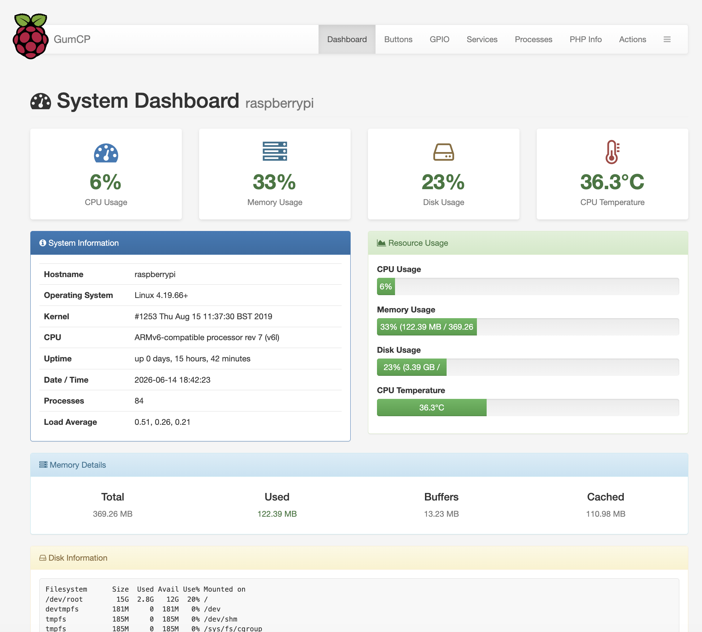
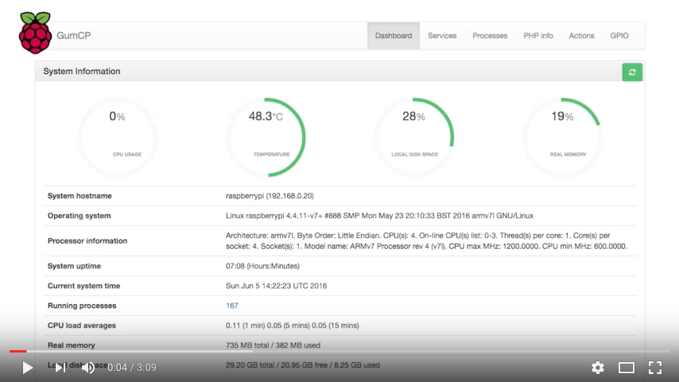

<a href="https://www.buymeacoffee.com/gumslone" target="_blank"></a>

# GumCP — Web Control Panel & Dashboard for Raspberry Pi

**GumCP** is a lightweight, self-hosted **web control panel for Raspberry Pi** — a simple open-source alternative to Webmin and Cockpit. Monitor your Pi from any browser (system dashboard with CPU, memory, temperature, disk, swap and network stats), control **GPIO** pins, manage **systemd services** and processes, run shell commands over **SSH**, and trigger custom **command buttons** via a REST-style **HTTP API**. Built with PHP and Apache, it runs on every model from the Pi 1 to the Pi 5 and is ideal for homelab and home-automation setups.

If you find GumCP useful, please **⭐️ star** the repo to help others find it!



More screenshots in the [screenshots folder](screenshots/).

[](https://youtu.be/rCi9OGLOstU)

---

## Features

- **Dashboard** — live CPU usage, temperature, memory, swap & disk, uptime, load averages, active users, per-interface network stats (IP, RX/TX, Wi-Fi signal), Raspberry Pi power/throttling status, configurable service status badges, and connected USB & block devices (auto-refreshes every 30 s without reloading the page)
- **Services** — list all system services with their status; start or stop any service with one click (loads asynchronously so the page appears instantly)
- **Processes** — browse running processes sorted by memory usage; kill by PID or name
- **GPIO control** — view and toggle pin mode (IN/OUT), voltage (HIGH/LOW) and pull-up/down for all header pins; auto-detects WiringPi (Pi 1–4) or raspi-gpio (Pi 5)
- **Raspberry Pi tools** — `vcgencmd` firmware, clock speeds, voltages, memory split and codec licences; enable/disable I2C, SPI, 1-Wire, SSH, VNC and camera via `raspi-config`; edit `config.txt` / `cmdline.txt` with automatic backup; live temperature & CPU-frequency history chart
- **Package Updates** — list upgradable apt packages with a count, refresh the index (`apt update`) and upgrade everything (`apt upgrade`) from the browser
- **System Logs** — browse the systemd journal, `dmesg` and `/var/log` files with adjustable line count and text filtering
- **Cron Jobs** — view, add and remove scheduled tasks in the user crontab; read-only view of `/etc/crontab`
- **Users & Groups** — read-only listing of system users and groups from `/etc/passwd` and `/etc/group`
- **Command Buttons** — create custom one-click buttons for any shell command; choose between a confirmation modal or direct execution with inline output; drag to reorder
- **Button API** — every button gets a unique secret URL; call it from curl, Home Assistant, or any automation tool without logging in
- **Actions** — execute arbitrary shell commands over SSH; run commands in the background with output saved to a log file; reboot; pull the latest GumCP version from GitHub with one click
- **phpinfo** — view PHP configuration directly from the browser
- **System Check** — built-in diagnostic page (`check.php`) that verifies PHP extensions, directory permissions, SSH connectivity and GPIO tools; Fix buttons repair common issues over SSH without touching the terminal
- **Menu reorder** — drag and drop navbar items into any order; preference saved automatically
- **Authentication** — optional login page, HTTP Basic Auth, or both simultaneously with separate credentials
- **Optional modules** — File Manager, Database Manager, TeHyBug sensor support (temperature, humidity, barometric pressure)

## Compatibility

| Raspberry Pi model | GPIO tool |
|---|---|
| Pi 1 / Pi 2 / Pi 3 / Pi 4 | WiringPi (community fork) |
| Pi 5 | raspi-gpio (automatic fallback) |

**PHP 7.0, 7.4, 8.0, 8.1, 8.2, 8.3** are all supported.

---

## Quick Install

Run these two commands on your Raspberry Pi (via SSH or a terminal):

```bash
sudo apt-get update && sudo apt-get install -y wget
wget https://raw.githubusercontent.com/gumslone/GumCP/master/installer.sh && bash ./installer.sh
```

The installer will:
- Install Apache, PHP and all required extensions (`php-ssh2`, `php-sqlite3`, `php-curl`, `php-zip`)
- Install WiringPi (Pi 1–4) or `raspi-gpio` (Pi 5) automatically
- Clone GumCP into `/var/www/html/GumCP/`
- Create `include/config.php` from the bundled template
- Create writable directories (`buttons/`, `command_logs/`) with correct ownership
- Set file permissions for the `www-data` web-server user

Once complete, open GumCP in a browser:

```
http://<your-pi-ip>/GumCP/
```

> **Default credentials** (set in `include/config.php`):
> - Username: `pi`
> - Password: `raspberry`
>
> **Change these before exposing GumCP to any network.**

---

## Uninstall

```bash
wget https://raw.githubusercontent.com/gumslone/GumCP/master/uninstall.sh && bash ./uninstall.sh
```

The uninstaller will:
- Ask whether to **back up** your `config.php`, buttons and logs to `~/gumcp_backup_<timestamp>/` before removing anything
- Remove `/var/www/html/GumCP/`
- Leave Apache, PHP, WiringPi and all other system packages untouched

---

## Manual Install

### 1. Install Apache and PHP

```bash
sudo apt-get update
sudo apt-get install -y apache2 php libapache2-mod-php php-ssh2 php-sqlite3 php-curl php-zip
sudo systemctl restart apache2
```

### 2. Install GPIO tool

**Pi 1, 2, 3, 4** — WiringPi community fork (the original `git.drogon.net` URL is no longer available):

```bash
git clone https://github.com/WiringPi/WiringPi.git ~/wiringPi
cd ~/wiringPi && ./build
```

**Pi 5** — WiringPi does not support the RP1 GPIO chip; use `raspi-gpio` instead:

```bash
sudo apt-get install -y raspi-gpio
```

GumCP's GPIO page detects the available tool automatically.

### 3. Clone and configure

```bash
sudo git clone https://github.com/gumslone/GumCP.git /var/www/html/GumCP
cd /var/www/html/GumCP

# Create your local config from the template
sudo cp include/config.example.php include/config.php

# Create runtime directories
sudo mkdir -p buttons command_logs

# Set ownership and permissions
sudo chown -R www-data:www-data /var/www/html/GumCP
sudo chmod -R 755 /var/www/html/GumCP
sudo chmod 664 /var/www/html/GumCP/include/config.php

# Allow the web server to read GPU throttling status (dashboard Power & Throttling panel)
sudo usermod -aG video www-data
sudo systemctl restart apache2
```

### 4. Configure

Edit `include/config.php` to set your credentials and SSH settings:

```bash
sudo nano /var/www/html/GumCP/include/config.php
```

Key settings:

```php
define('SSH_PORT', '22');        // SSH port
define('SSH_USER', 'pi');        // SSH username
define('SSH_PASS', 'raspberry'); // SSH password

define('LOGIN_REQUIRED', false); // true = require login via the login page
define('LOGIN_USER', 'pi');
define('LOGIN_PASS', 'raspberry');

define('BASIC_AUTH', false);     // true = also accept HTTP Basic Auth
define('BASIC_AUTH_USER', 'api');
define('BASIC_AUTH_PASS', 'secret');
```

---

## Upgrade

`include/config.php`, `buttons/` and `command_logs/` are **not tracked by git** — your credentials, buttons and logs are preserved across upgrades automatically.

```bash
cd /var/www/html/GumCP
sudo git pull origin master
```

Or use the **Update GumCP** button on the Actions page — no terminal needed.

---

## Authentication

GumCP supports three modes, configurable independently:

| Mode | Config | Description |
|---|---|---|
| Open | both `false` | No login required (local network use) |
| Login page | `LOGIN_REQUIRED=true` | Browser redirected to login form |
| Basic Auth | `BASIC_AUTH=true` | Browser shows native credentials dialog; curl/API clients send `Authorization` header |
| Both | both `true` | Either method grants access; separate credentials for each |

```php
// Login page
define('LOGIN_REQUIRED', true);
define('LOGIN_USER', 'admin');
define('LOGIN_PASS', 'changeme');

// HTTP Basic Auth (separate credentials — useful for API/curl access)
define('BASIC_AUTH', true);
define('BASIC_AUTH_USER', 'api');
define('BASIC_AUTH_PASS', 'secret');
```

---

## Command Buttons

Create one-click buttons for any shell command from the **Buttons** page.

### Execution modes

| Mode | Behaviour |
|---|---|
| Modal (default) | Click opens a dialog showing the command; press Execute to run; output shown in the dialog |
| Direct | Click runs immediately; output appears inline below the button |

Toggle between modes with the **Direct execution** checkbox when creating or editing a button.

### Button API

Enabled by default. Disable in `config.php` like any other module:

```php
$gumcp_modules['button_api']['module_active'] = 0;
```

Every button gets a unique secret hash. Use it to trigger the button from any HTTP client without logging in — no session or Basic Auth required:

```bash
curl http://<your-pi-ip>/GumCP/api.php?hash=<32-char-hash>
```

Response:

```json
{"success": true, "button": "Restart Apache", "output": ""}
```

The API URL is shown in the button's **Edit** dialog. Use **Regenerate hash** to invalidate an old URL and get a new one instantly.

Every API call is logged to `command_logs/api_calls.log` (JSON lines) with timestamp, IP, user-agent, and command output. Log files are not accessible via the browser.

**Example: trigger from Home Assistant**

```yaml
rest_command:
  restart_apache:
    url: "http://192.168.1.10/GumCP/api.php?hash=a3f8c2d1e4b79056..."
    method: GET
```

---

## System Check

GumCP includes a built-in diagnostic tool. Open it in your browser:

```
http://<your-pi-ip>/GumCP/check.php
```

Or run the CLI version on the Pi:

```bash
# Check only
bash /var/www/html/GumCP/check.sh

# Check and auto-fix permissions/missing directories
sudo bash /var/www/html/GumCP/check.sh --fix
```

The check covers PHP extensions, directory writability, SSH connectivity, GPIO tools and required system commands. Each failing item shows a **Fix** button that applies the repair over SSH without needing a terminal.

---

## Troubleshooting

### Actions or Buttons page returns an SSH error

These pages require the `php-ssh2` extension and a running SSH server:

```bash
sudo apt-get install -y php-ssh2
sudo systemctl enable ssh && sudo systemctl start ssh
sudo systemctl restart apache2
```

### "Failed to save button — check that the buttons directory is writable"

The `buttons/` directory is missing or not owned by `www-data`:

```bash
sudo mkdir -p /var/www/html/GumCP/buttons
sudo chown www-data:www-data /var/www/html/GumCP/buttons
```

Or use the System Check page's Fix button.

### GPIO page shows no data

- **Pi 1–4:** Install WiringPi (see above) and verify with `gpio readall`
- **Pi 5:** Install `raspi-gpio`: `sudo apt-get install -y raspi-gpio` and verify with `raspi-gpio get`

### Basic Auth not working (login page still shown)

Apache strips the `Authorization` header by default. The included `.htaccess` passes it through via `RewriteRule`. Make sure `mod_rewrite` is enabled:

```bash
sudo a2enmod rewrite
sudo systemctl restart apache2
```

### Dashboard "Power & Throttling" shows "not available"

`vcgencmd` needs GPU access, which the `www-data` web user lacks by default. Add it to the `video` group:

```bash
sudo usermod -aG video www-data
sudo systemctl restart apache2
```

(The installer does this automatically on Raspberry Pi hardware.) On non-Pi hardware the panel is expected to stay unavailable.

### TeHyBug module

TeHyBug is a low-power temperature/humidity/pressure Wi-Fi tracker available at [Tindie](https://www.tindie.com/stores/gumslone/).

Enable it in `config.php` (`module_active => 1`). Requires SQLite:

```bash
sudo apt-get install -y php-sqlite3
```

---

## Security Notes

- **Change default credentials** in `include/config.php` before putting GumCP on any network
- Enable `LOGIN_REQUIRED` and/or `BASIC_AUTH` in `config.php` for protected access
- Button API is enabled by default — set `$gumcp_modules['button_api']['module_active'] = 0` in `config.php` to disable it
- Button API hashes are secret URLs — treat them like passwords; use **Regenerate hash** if a hash is compromised
- `command_logs/` and `buttons/` are blocked from direct web access via `.htaccess`
- GumCP executes commands as the SSH user — use a dedicated user with only the permissions it needs
- `robots.txt` is included and blocks all search crawlers from indexing GumCP

---

## FAQ

**Is GumCP a Webmin or Cockpit alternative for Raspberry Pi?**
Yes — it's a lightweight, single-purpose web control panel focused on Raspberry Pi: system monitoring, GPIO, services, processes and one-click command buttons. It installs in minutes on Raspberry Pi OS with no database required.

**Which Raspberry Pi models are supported?**
All of them — Pi 1, 2, 3, 4 and Pi 5. GPIO uses WiringPi on Pi 1–4 and `raspi-gpio` on Pi 5 automatically.

**Can I monitor my Raspberry Pi remotely from a browser?**
Yes. The dashboard shows live CPU, memory, swap, disk, temperature, throttling and per-interface network stats, auto-refreshing without a page reload. Protect remote access with the built-in login page or HTTP Basic Auth.

**Can I trigger commands from Home Assistant or scripts?**
Yes — every command button has a secret HTTP API URL you can call from Home Assistant, curl, or any automation tool.

---

## Keywords

Raspberry Pi web control panel · Raspberry Pi dashboard · Raspberry Pi system monitor · Raspberry Pi GPIO web interface · Webmin alternative · Cockpit alternative · self-hosted Pi monitoring · homelab control panel · PHP Raspberry Pi admin panel · remote Raspberry Pi management.

---

[](https://www.paypal.com/donate/?hosted_button_id=VCWHQPACTXV5N)
